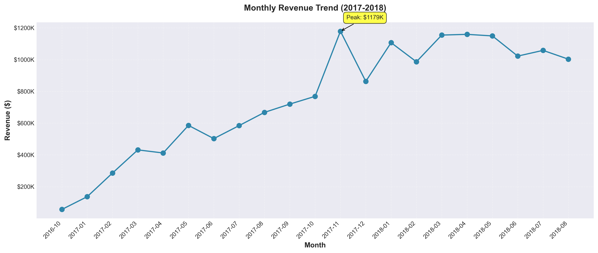
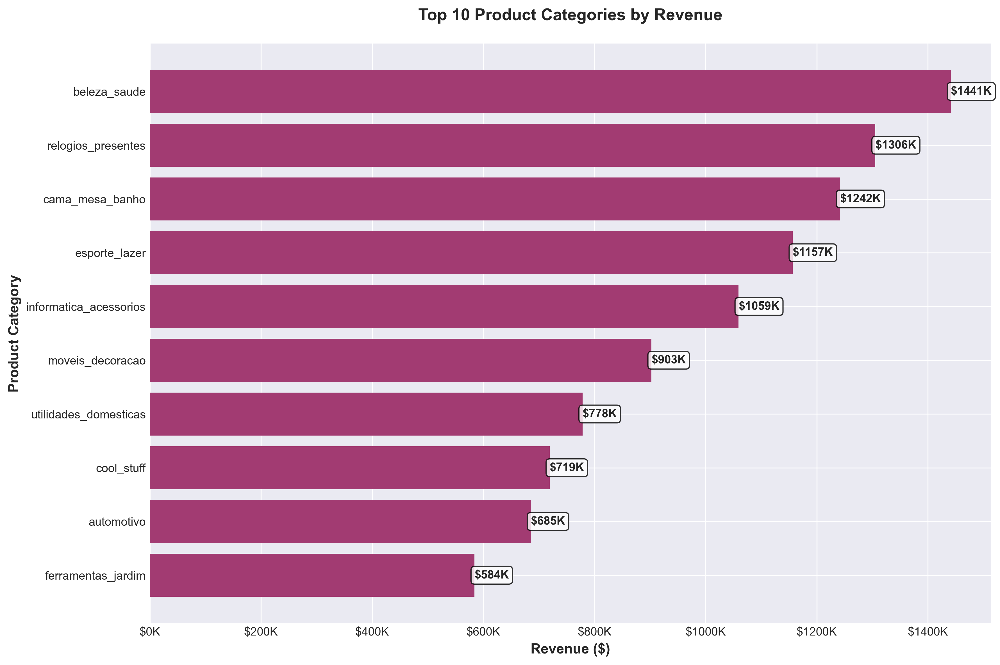
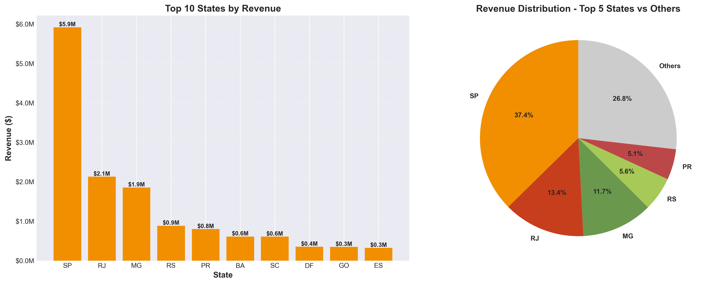
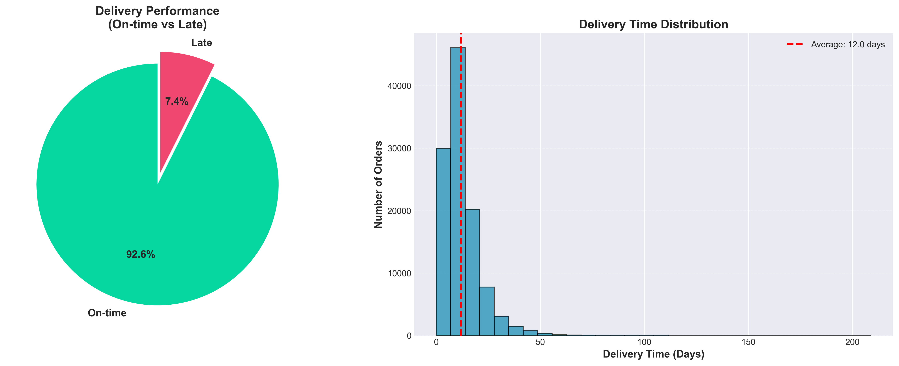

# E-Commerce Sales Performance Analysis

A comprehensive business analysis of 2 years of e-commerce transaction data from a Brazilian marketplace, analyzing $15.8M in revenue across 99,441 orders.

## Business Problem

An e-commerce platform needs to understand:
- Revenue trends and growth patterns
- Customer behavior and retention issues
- Product category performance
- Geographic market distribution
- Delivery operations efficiency
- Payment method preferences

## Key Findings

### Revenue Performance
- **Total Revenue**: $15.8 Million (2016-2018)
- **Total Orders**: 99,441 orders
- **Average Order Value**: $159.33
- **Peak Month**: November 2017 - $1.18M (Black Friday effect)

### Critical Issues Identified
1. **0% Repeat Purchase Rate** - No customer loyalty, massive revenue loss
2. **Geographic Concentration** - 62.5% revenue from only 3 states
3. **Late Deliveries** - Some states have 16-23% late delivery rates
4. **Missing Data** - 2,378 products without category classification

### Top Opportunities
- Implement customer retention program: +$1.5M potential annual revenue
- Expand to underserved regions: +15% revenue growth
- Optimize delivery logistics: +15% customer satisfaction
- Leverage installment payments: +8% average order value

## Tools & Technologies

- **Python 3.11**: Data processing and analysis
- **Pandas & NumPy**: Data manipulation
- **Matplotlib & Seaborn**: Data visualization
- **Jupyter Notebook**: Interactive analysis
- **Git**: Version control

## Project Structure
```
ecommerce-sales-analysis/
├── data/
│   ├── raw/              # Original CSV files
│   └── processed/        # Cleaned master dataset
├── notebooks/
│   ├── 01_data_exploration.ipynb    # Data loading & preparation
│   └── 02_business_analysis.ipynb   # Business insights & visualizations
├── reports/              # Generated charts and reports
├── src/                  # Python scripts (future)
└── README.md
```

## Analysis Highlights

### 1. Monthly Revenue Trend

- Clear growth pattern from 2017-2018
- Seasonal peaks in November (Black Friday)
- Stable $1M+ monthly revenue in mature period

### 2. Top Product Categories

- Beauty & Health leads with $1.44M (9.2%)
- Top 5 categories: 40% of total revenue
- Opportunity to expand successful categories

### 3. Geographic Distribution

- São Paulo (SP): 37.4% of revenue
- Top 3 states (SP, RJ, MG): 62.5% of revenue
- Significant growth potential in other regions

### 4. Delivery Performance

- 92.6% on-time delivery (excellent)
- Average delivery: 12 days
- Regional improvement needed (AL, MA, SE)

## Business Recommendations

### Priority 1: Customer Retention (CRITICAL)
**Problem**: 0% repeat customers
**Solution**: 
- Launch loyalty program
- Email remarketing campaigns
- Second purchase discounts
**Expected Impact**: +$1.5M annual revenue

### Priority 2: Geographic Expansion
**Problem**: Revenue concentration in 3 states
**Solution**: 
- Improve logistics in underserved regions
- Local seller partnerships
- Regional marketing campaigns
**Expected Impact**: +15% revenue growth

### Priority 3: Delivery Optimization
**Problem**: High late delivery rates in northeast
**Solution**: 
- Regional carrier partnerships
- Realistic delivery estimates
- Seller network expansion
**Expected Impact**: <5% late deliveries, improved ratings

## Dataset Information

**Source**: Brazilian E-Commerce Public Dataset by Olist
**Period**: September 2016 - October 2018
**Records**: 113,425 order items
**Size**: 124.97 MB (processed)

## How to Run This Analysis

1. Clone the repository
2. Install requirements: `pip install -r requirements.txt`
3. Open Jupyter notebooks in `notebooks/` folder
4. Run cells sequentially

## License

This project is for portfolio and educational purposes.
## Data Source

The raw dataset is not included in this repository due to size constraints (58MB+). 

To reproduce this analysis:
1. Download the dataset from [Kaggle - Brazilian E-Commerce Dataset](https://www.kaggle.com/datasets/olistbr/brazilian-ecommerce)
2. Extract the CSV files to `data/raw/archive (29)/`
3. Run the notebooks in order

The processed master dataset (`data/processed/master_sales_data.csv`) is included for reference.
